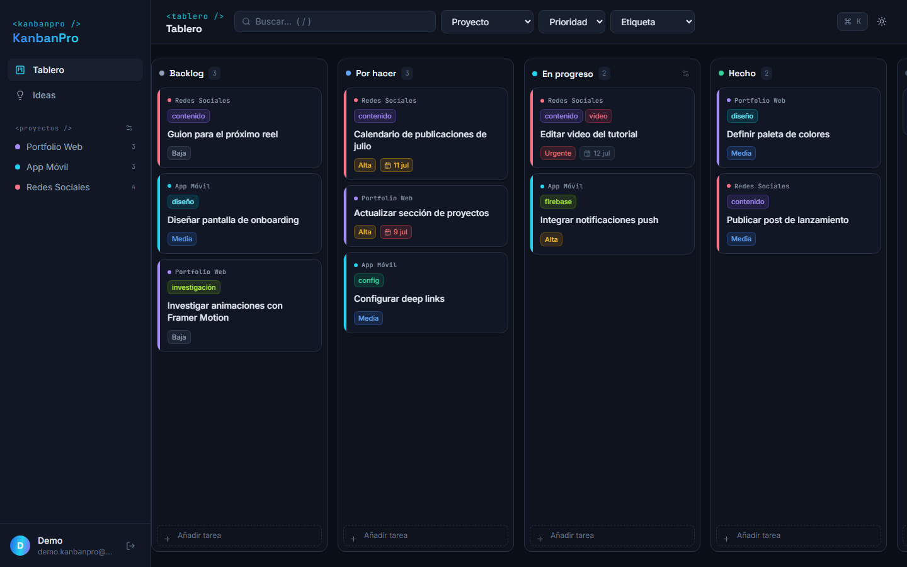
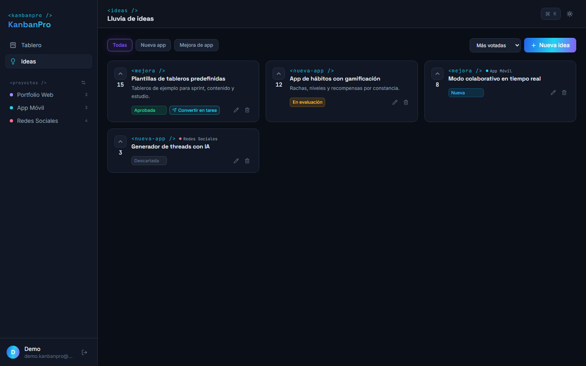

<div align="center">

# `<kanbanpro />`

**Gestión de trabajo tipo kanban + lluvia de ideas, en tiempo real.**

[](https://kanbanpro-anthony.web.app/login?demo)

[](https://react.dev)
[](https://vitejs.dev)
[](https://firebase.google.com)
[](https://tailwindcss.com)
[](https://dndkit.com)



</div>

## ✨ Pruébala sin registrarte

**[→ Entrar a la demo](https://kanbanpro-anthony.web.app/login?demo)** — un clic y estás dentro, con datos de ejemplo. Arrastra tarjetas, filtra por proyecto, vota ideas. Si alguien deja la demo hecha un desastre, los datos se resiembran solos.

También puedes crear tu propia cuenta con Google o email — tus datos son solo tuyos (reglas de Firestore por usuario).

## Funcionalidades

- **Tablero kanban** con 5 columnas y drag & drop fluido (`@dnd-kit`), reordenación dentro de columna y persistencia inmediata con UI optimista.
- **Proyectos con color**: cada tarjeta lleva la franja y el chip de su proyecto; el sidebar los lista con contador y un clic filtra el tablero.
- **Tarjetas ricas**: etiquetas de color, prioridad (baja → urgente), fecha límite con aviso visual (rojo vencida, ámbar &lt;48 h), descripción.
- **Lluvia de ideas** 💡: categorías (nueva app / mejora), votación, estados (nueva → en evaluación → aprobada → descartada) y **convertir en tarea** con un clic (hereda el proyecto).
- **Command palette** (`Ctrl/Cmd+K`) y atajos: `N` nueva tarea, `I` nueva idea, `/` buscar.
- **Filtros en tiempo real** por texto, proyecto, prioridad y etiqueta.
- Límite WIP configurable en "En progreso" con aviso visual.
- Tema oscuro/claro persistente, confeti al completar 🎉, toasts, estados vacíos cuidados y diseño responsive (columnas con scroll snap en móvil).

<div align="center">

</div>

## Stack

| Capa | Tecnología |
|---|---|
| UI | React 18 + Vite, Tailwind CSS 3, lucide-react |
| Drag & drop | @dnd-kit/core + @dnd-kit/sortable |
| Backend | Firebase: Authentication (Google + email), Cloud Firestore, Hosting |
| Extras | canvas-confetti, react-router 7 |

## Decisiones técnicas

**Orden fraccionario en Firestore.** Cada tarjeta guarda un `order` numérico; al soltarla se escribe `(prev + next) / 2`. Mover una tarjeta cuesta **un solo write**, sin reindexar la columna.

**UI optimista gratis.** Las suscripciones `onSnapshot` de Firestore aplican los writes locales al instante (compensación de latencia); no hace falta duplicar estado ni reconciliar a mano.

**Colisiones de drag & drop.** `closestCorners` a secas falla con columnas vacías: el droppable de la propia tarjeta activa "gana" la colisión. La solución: `pointerWithin` con fallback a `closestCorners`, excluyendo siempre la tarjeta activa de los candidatos.

**Multi-tenant desde el día 1.** Todo cuelga de `users/{uid}/...` y las reglas de Firestore garantizan que cada usuario solo lee/escribe lo suyo. Convertir esto en un SaaS con workspaces no requiere migrar el modelo.

## Modelo de datos

```
users/{uid}                    perfil y preferencias (tema, límite WIP)
users/{uid}/projects/{id}      nombre + color
users/{uid}/tasks/{id}         título, columna, order, etiquetas, prioridad,
                               fecha límite, projectId
users/{uid}/ideas/{id}         título, categoría, votos, estado, projectId
```

## Desarrollo local

```bash
git clone https://github.com/anthonymzch/KanbanPro.git
cd KanbanPro
npm install
npm run dev        # http://localhost:5174
npm run build      # producción en dist/
```

> La config de Firebase incluida apunta al proyecto de producción (las API keys de Firebase son públicas por diseño; la seguridad la imponen las reglas de Firestore). Para tu propia instancia: crea un proyecto en Firebase, habilita Auth + Firestore y reemplaza la config en `src/lib/firebase.js`.

## Licencia

[MIT](LICENSE) — hecho con ☕ por [Anthony Mendoza](https://github.com/anthonymzch)
